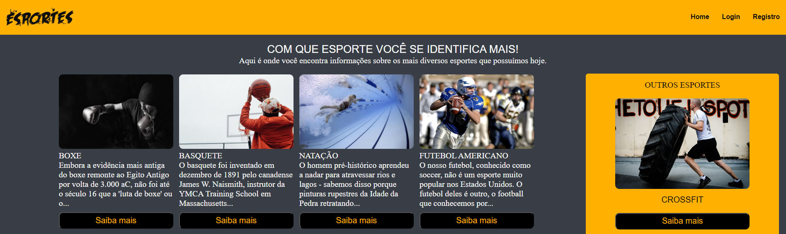

# Modelo de site - Curiosidades dos esportes

Um modelo de site elaborado, onde pode-se ver curiosidades sobre alguns esportes e também registrar-se e fazer login.

## 📄 Índice

- <a href="#-funcionalidades-do-projeto">Funcionalidades do Projeto</a>
- <a href="#-layout">Layout</a>
- <a href="#-demonstração">Demonstração</a>
- <a href="#=link-do-site">Link do site</a>
- <a href="#-tecnologias-utilizadas">Tecnologias Utilizadas</a>
- <a href="#-autor-do-projeto">Autor do Projeto</a>

## 💻 Funcionalidades do Projeto

- [x] Página principal com links para informações
- [x] Login
- [x] Registro

## 💻 Layout

Uma amostra da tela de login do site.

Uma amostra da tela de registro do site, onde o usuário pode cadastrar-se e criar uma conta.

## 🖥 Demonstração

<a href="https://projeto-modelo-site.vercel.app/index.html" target="_blank">

## 🛠 Tecnologias Utilizadas

1. [HTML](https://developer.mozilla.org/pt-BR/docs/Web/HTML)
2. [CSS](https://developer.mozilla.org/pt-BR/docs/Web/CSS)
3. [JavaScript](https://developer.mozilla.org/pt-BR/docs/Web/JavaScript)

## Autor do Projeto

Pedro Chaves Heineck

[Linkedin](www.linkedin.com/in/pedro-heineck-821982284)
